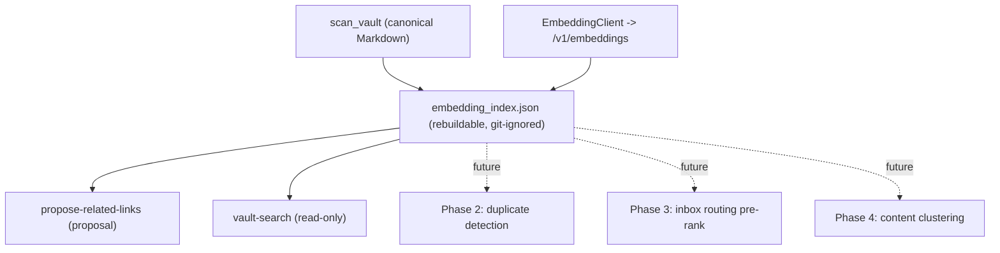

# Embeddings Roadmap

This document records how embeddings are used in pi-vault and the phased plan for
expanding their use. The guiding principle is the same as the rest of the engine:
embeddings power **retrieval and ranking**, never authority. All derived embedding
state is rebuildable from canonical Markdown, git-ignored, and every action that
changes notes stays proposal-first and reviewable.

## Why embeddings (and where they do not belong)

Embeddings add real capability only where the task is fundamentally about
**similarity across the whole vault**, which the single-note LLM stages cannot see.
They are deliberately **not** used for constrained-vocabulary judgments
(type classification, status/domain/property values) or for risky identity merges
(people entity resolution), where reasoning or explicit rules are safer.

## Model and configuration

- Endpoint: OpenAI-compatible `/v1/embeddings` (default `http://llms:8005`).
- Model: Qwen3-Embedding via the configured local alias (currently validated
  against Qwen3-Embedding-4B at `embedding_model: embed`).
- No new runtime dependency: requests use `urllib`; similarity is pure-Python cosine.
- Config block (`99 System/0.01 agent/config.yaml`):

```yaml
embeddings:
  enabled: false        # off by default; deterministic runs are unaffected
  top_k: 5              # neighbors / results
  min_similarity: 0.55  # search floor in the mean-centered space
  related_min_similarity: 0.65
  duplicate_min_similarity: 0.97
  batch_size: 32        # keep modest on shared GPU hosts
  excerpt_chars: 6000   # note body chars embedded per note
llm:
  embedding_base_url: http://llms:8005
  embedding_model: embed
```

### Mean-centering

Raw cosine over Qwen3 embeddings has a high baseline (random note pairs sit
around 0.59), which compresses every note into a narrow 0.75-0.90 band and makes
an absolute threshold blunt. The index therefore stores the corpus mean embedding
and ranking is done on mean-centered vectors (equivalent to centered cosine /
Pearson correlation). On the Memex test vault this roughly doubled the separation
between a note's true nearest neighbor and a random pair (0.30 to 0.75) and pushed
spurious cross-topic matches out of the top results. Centering is degenerate for
very small corpora (two notes become antipodal), so it activates only at >= 25
notes; below that the index falls back to raw cosine. The mean is recomputed on
every full index build and is rebuildable like the rest of the index.

### Server batch size

For embedding models the whole input sequence must fit in one physical batch, so
the server's ubatch token cap bounds how much of a note can be embedded at once.
On an OpenAI-compatible llama.cpp server set `-ub`/`-b` to at least the largest
excerpt's token count (e.g. `-ub 2048 -b 2048`). The client tolerates smaller
caps: on a "too large" rejection it splits the batch to isolate the offending
input and truncates that input by the server-reported token ratio before retrying.

### Calibration (Qwen3-Embedding-4B)

A calibration over the ~1100-note Memex test vault informs the defaults:

- Raw cosine remains high and compressed: nearest-neighbor median was ~0.91
  while random pairs sat around ~0.69. An absolute raw floor is still blunt.
- Mean-centering remains necessary: random centered pairs had median similarity
  near zero, while nearest-neighbor median was ~0.70.
- `min_similarity: 0.55` remains useful for search candidate filtering, but
  related-link proposals use `related_min_similarity: 0.65` for better precision.
- Near-duplicates and repeated extracted artifacts cluster at the top; use
  `duplicate_min_similarity: 0.97` for duplicate-candidate surfacing.

## Architecture



The index is keyed by note path and invalidated by the scanner's content hash and
the embedding backend's model metadata, so model upgrades re-embed stale vectors
even when the configured alias stays `embed`. It lives under
`99 System/0.01 agent/retrieval/embedding/index.json` and is excluded from
versioning, matching the reserved `retrieval/embedding*/`, `retrieval/vector*/`,
and `*.sqlite` git-ignore patterns.

## Phases

### Phase 0 - Foundation (implemented)

- `vault_agent/embeddings.py`: `EmbeddingClient`, `cosine`, `rank`,
  `embedding_client_from_config`.
- `vault_agent/embedding_index.py`: rebuildable JSON index, incremental refresh,
  `query` helper.
- Config `embeddings:` block; `embed-index` command; `rebuild-retrieval` refreshes
  the index when embeddings are enabled.

### Phase 1 - Related links and semantic search (implemented)

- **Related-note discovery** (`propose-related-links`): for a bounded batch of
  notes, take nearest neighbors above `related_min_similarity`, drop the note
  itself, existing `related`, and `parent`, and emit append-only
  `update_frontmatter` operations as a pending `related-links` proposal. Never
  removes links; applied only through the normal `review-proposals` path.
- **Semantic search** (`vault-search`): embed a free-text query and rank notes by
  mean-centered cosine with a bounded title/path lexical boost for entity and
  project names. Read-only; complements the deterministic retrieval files.

### Phase 2 - Near-duplicate / merge-candidate detection (planned)

- Approach: scan the index for note pairs above a high similarity threshold
  (calibration suggests >= 0.97 for true near-duplicates; ~0.95 for strong
  overlap) and surface them as merge candidates.
- Integration: new module + `propose-duplicates` command writing a review-gated
  proposal. No automatic merge or delete; humans/agents decide.
- Difficulty: Medium (reuses the index; main work is pair selection and a clear
  review report).
- Risks: false positives on templated notes; never auto-apply. Keep the report
  inspectable and conservative on the threshold.

### Phase 3 - Embedding-assisted inbox routing (planned)

- Approach: pre-rank candidate destination folders by similarity between a note
  and each folder's description and/or member centroid, then either decide
  directly when the margin is large or hand the LLM a shortlist of 2-3 folders.
- Integration: `assign_custom_destination` in `vault_agent/layout_routing.py`,
  which today sends the whole note plus the full folder catalog to a serialized
  per-note chat completion.
- Difficulty: Medium. Reuses the folder catalog already in config.
- Benefit: cuts the serialized-LLM bottleneck (one cheap embed vs. a full
  generation per note); preserves the existing confidence-gated fallback.
- Risks: keep deterministic routing authoritative for typed notes; embeddings
  only assist the fuzzy custom/general cases.

### Phase 4 - Content-based topic-hub clustering (planned, optional)

- Approach: cluster note embeddings (e.g. k-means or community detection) to
  suggest topic hubs that cross folder boundaries, beyond the folder-name
  clustering in `vault_agent/topic_hubs.py`.
- Integration: extend `cluster_candidate_hubs` to optionally use embedding
  clusters; output stays a reviewable schema-change proposal.
- Difficulty: Higher; clustering is fuzzier and harder to keep inspectable.
- Risks: determinism and explainability. Lower priority than Phases 2-3.

## Out of scope

- Type/property classification stays with the LLM (constrained vocabularies).
- People entity resolution by embedding (high false-merge cost); keep alias rules
  plus LLM classification.
- A heavyweight vector database or ANN library; pure-Python cosine is sufficient
  at vault scale (thousands of notes x ~1k dims). Revisit only if a vault grows
  large enough to need it, and keep any store rebuildable from Markdown.
